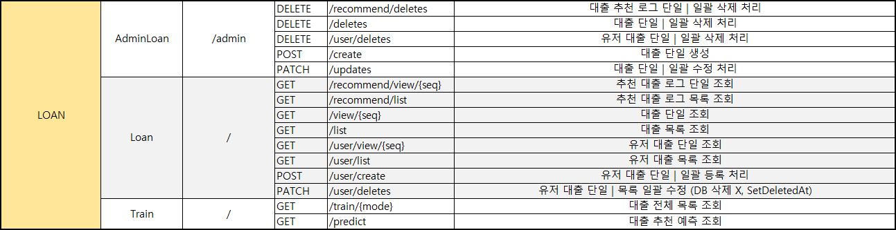
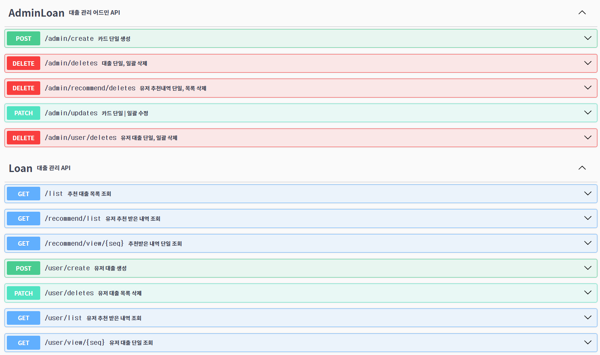
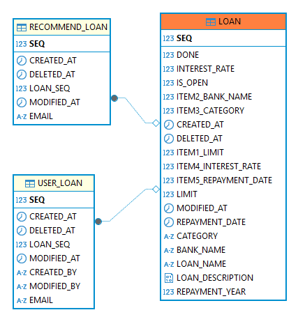

  

# AnonymousCIS 프로젝트

# 기능 명세서

## 🔹 도메인 URL 설계 🔹

## 🔹 관리자 페이지 🔹
 - 대출 추천 로그 단일 | 일괄 삭제 처리
 - 대출 단일 | 일괄 삭제 처리
 - 유저 대출 단일 | 일괄 삭제 처리
 - 대출 단일 생성
 - 대출 단일 | 일괄 수정 처리
## 🔹 사용자(회원) 페이지 🔹
 - 추천 대출 로그 단일 조회
 - 추천 대출 로그 목록 조회
 - 대출 단일 조회
 - 대출 목록 조회
 - 유저 대출 단일 조회
 - 유저 대출 목록 조회
 - 유저 대출 단일 | 일괄 등록 처리
 - 유저 대출 단일 | 목록 일괄 수정 (DB 삭제 X, SetDeletedAt)
## 🔹 머신러닝 학습 및 예측 페이지 🔹
 - 대출 전체 목록 조회 페이지네이션 X
 - 대출 추천 예측 조회
## 🔹 Swagger API 🔹
- 링크 : https://cis-loan-service.koreait.xyz/apidocs.html

  

# ERD 작성 (엔티티 관계도)

# LOAN
| 키  | 논리            | 물리                   | 도메인             | 타입          | Length | UNIQUE | NULL허용 | 기본값     |
|:--:|:--------------|:---------------------|-----------------|-------------|--------|--------|--------|:--------|
| pk | 대출 등록 번호      | SEQ                  | Long            | NUMBER      |        |        | N      |         |
|    | 대출 이름         | LOAN_NAME            | String          | VARCHAR     | 100    |        | N      |         |       |
|    | 대출 한도         | LIMIT                | Long            | NUMBER      |        |        | N      |         |  |
|    | 은행 종류 (Enum)  | BANK_NAME            | BankName (Enum) | VARCHAR     | 50     |        | N      |         |       |
|    | 대출 종류 (Enum)  | CATEGORY             | Category (Enum) | VARCHAR     | 30     |        | N      |         |       |
|    | 이자율           | INTEREST_RATE        | Double          | FLOAT       |        |        | N      |         |
|    | 대출 설명         | LOAN_DESCRIPTION     | String          | TEXT        |        |        | Y      |         |       |
|    | 대출 상환일        | REPAYMENT_YEAR       | Long            | NUMBER      |        |        | Y      |         |       |
|    | 일반 유저에게 공개 여부 | IS_OPEN              | boolean         | NUMBER(1,0) |        |        | N      |         |       |
|    | 학습 완료 여부      | DONE                 | Boolean         | NUMBER(1,0) |        |        | N      |         |       |
|    | 대출한도 특성1      | ITEM1_LIMIT          | Long            | NUMBER      |        |        | Y      |         |       |
|    | 대출한은행이름 특성2   | ITEM2_BANK_NAME      | int             | NUMBER      |        |        | Y      |         |       |
|    | 대출특성 특성3      | ITEM3_CATEGORY       | int             | NUMBER      |        |        | Y      |         |       |
|    | 이자율 특성4       | ITEM4_INTEREST_RATE  | Long            | NUMBER      |        |        | Y      |         |       |
|    | 상환날짜 특성5      | ITEM5_REPAYMENT_DATE | Long            | NUMBER      |        |        | Y      |         |       |
|    | 등록일시          | CREATEDAT            | LocalDateTime   | DATE        |        |        | Y      | SYSDATE |
|    | 수정일시          | MODIFIEDAT           | LocalDateTime   | DATE        |        |        | Y      | SYSDATE |
|    | 삭제일시          | DELETEDAT            | LocalDateTime   | DATE        |        |        | Y      | SYSDATE |

# RecommendLoan
| 키  | 논리       | 물리    | 도메인    | 타입      | Length | UNIQUE | NULL허용 | 기본값 |
|:--:|:---------|:------|--------|---------|--------|--------|--------|:----|
| pk | 대출 등록 번호 | SEQ   | Long   | NUMBER  |        |        | N      |     |
|    | 이메일      | EMAIL | String | VARCHAR | 255    |        | N      |     |       |
|    | 대출       | LOAN  | Loan   | ENTITY  |        |        | N      |     |  |

# UserLoan
| 키  | 논리       | 물리    | 도메인    | 타입      | Length | UNIQUE | NULL허용 | 기본값 |
|:--:|:---------|:------|--------|---------|--------|--------|--------|:----|
| pk | 대출 등록 번호 | SEQ   | Long   | NUMBER  |        |        | N      |     |
|    | 이메일      | EMAIL | String | VARCHAR | 255    |        | N      |     |       |
|    | 대출       | LOAN  | Loan   | ENTITY  |        |        | N      |     |  |